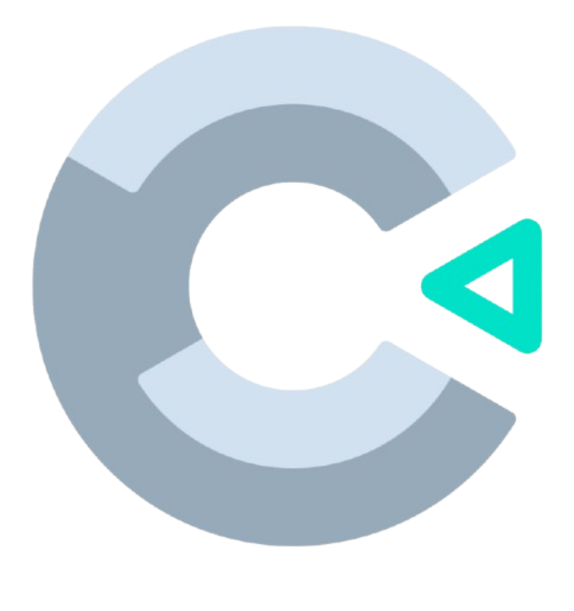
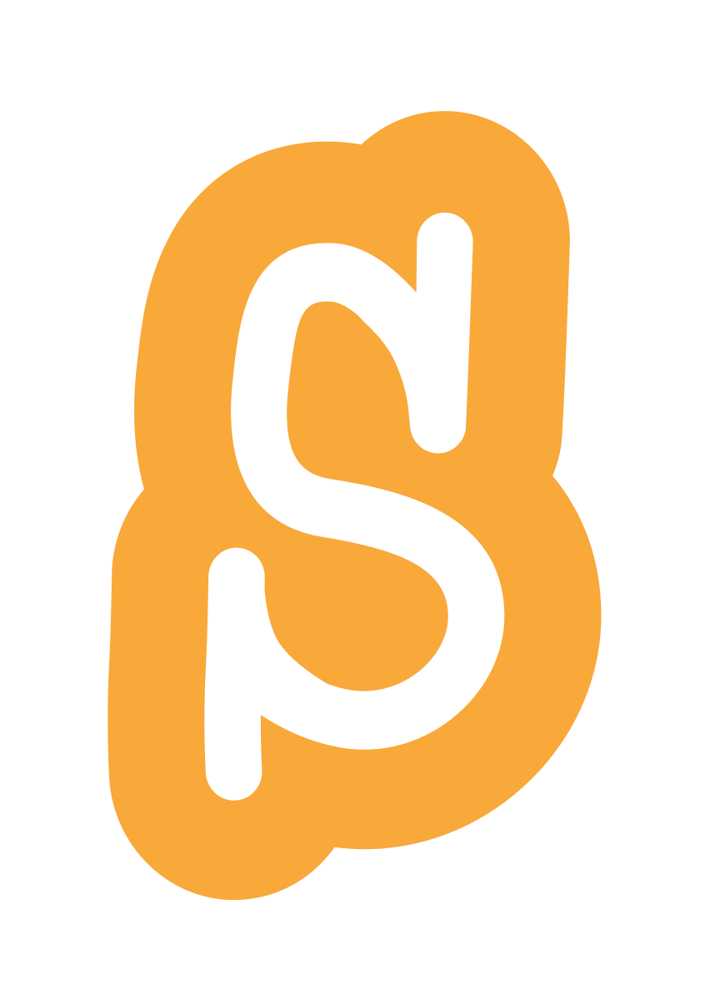
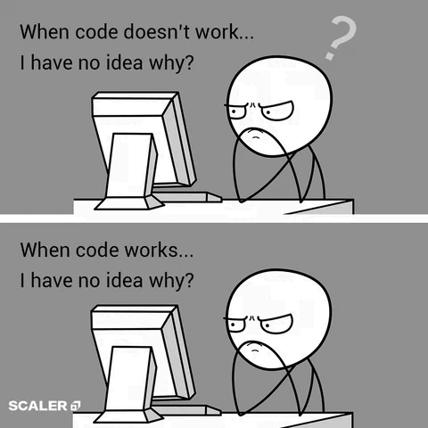

# 👋 Hello, I'm Rhayanne

🎓 **Computer Science Graduate** at Federal University of Paraná (UFPR).   
💡 **Aspiring Full-Stack Developer** with a passion for building and learning.  
🔧 Currently improving through personal projects and hands-on coding.  
📍 Open to any opportunity that helps me grow as a developer and professional.  

---

## 🛠️ Languages & Tools I've Worked With

### 💻 Programming/Markup Languages

---

### 🧰 IDEs & Tools

  
  
  
  
  
  
  
  
  
  
  

---

## 🚀 What I'm Doing Now

- 🔭 Working on full-stack projects to sharpen my skills and expand my experience.
- 🌱 Learning React and Node.js to complete the full-stack cycle.
- 🧠 Revisiting core CS concepts (data structures, OOP, algorithms).
- 🤖 Exploring machine learning fundamentals and Python libraries.
- ☁️ Gaining familiarity with cloud platforms like AWS and Docker for deployment.  

---

## 🔍 What I’m Looking For

- 🎯 Just starting out and excited for any opportunities, internships, projects, or entry-level roles. 
- 💡 My main goal is to gain practical experience, learn from others, and contribute wherever I can.
- 📈 I’m eager to grow in a real-world environment, whether that’s through remote or in-person work.
- 🤝 I'm highly motivated, a fast learner, and excited to take on new challenges and continue growing as a developer.

---

## 📌 Featured Projects

### 🎲 Guess the Number Game

### 🚀 Live Demo

Play here ⇒ [Link](https://guessnumbergamegui.netlify.app)

---

## 📫 Let's Connect

- Email: rhayanne.yn@gmail.com 
- Teams: [Start a chat here](https://teams.live.com/l/invite/FAAxw3JMLlJ3ql1GwE?v=g1)
- Discord: [Or here](https://discordapp.com/users/1263262440255131661/)
- Slack: [Also here](https://join.slack.com/t/ringelblume/shared_invite/zt-3j88mw5kn-LiwlVQhw9SFh0dxUiC7Jgg)

---

### 🌍 Other Experience (ENG ⇄ PT-BR)

- 💬 Translator and Revisor for TEDx content. 
- 📚 Book translation and proofreading. 
- 🎮 Game localization and subtitling.
- 🧑‍🏫 Online language tutor for international students.
- 🔧 Worked with professional CAT tools: SDL Trados Studio, memoQ, Matecat, Smartcat, OmegaT.
  

---

  

  

