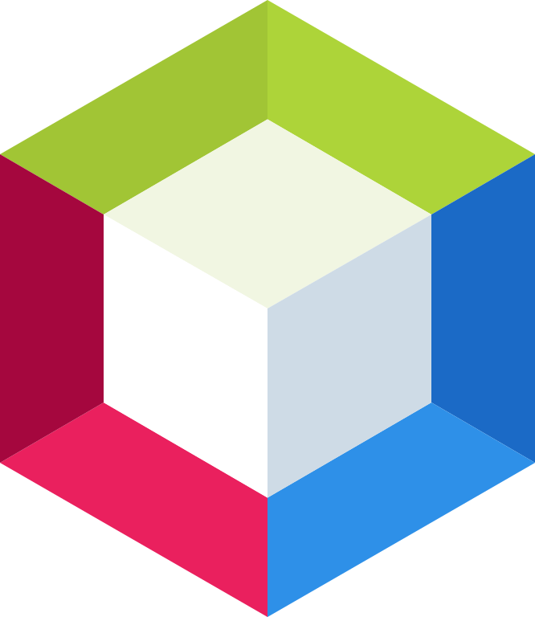

# 👋 Hi, I'm Rhayanne

🎓 **Computer Science Graduate** at Federal University of Paraná (UFPR).  
💡 **Aspiring Full-Stack Developer** with a passion for building and learning.  
🔧 Currently improving through personal projects and hands-on coding.  
📍 Open to any opportunity that helps me grow as a developer and professional.

---

## 🛠️ Languages & Tools I've Worked With

### 💻 Programming/Markup Languages

---

### 🧰 IDEs & Tools

  
  
  
  
  
  
  
  
  
  
  

---

## 🚀 What I'm Doing Now

- 🔭 Working on full-stack projects to sharpen my skills and expand my experience.
- 🌱 Learning React and Node.js to complete the full-stack cycle.
- 🧠 Revisiting core CS concepts (data structures, OOP, algorithms).
- 🤖 Exploring machine learning fundamentals and Python libraries.
- ☁️ Gaining familiarity with cloud platforms like AWS and Docker for deployment.  

---

## 📌 Featured Projects *(Coming Soon)*

> I’m actively working on a few personal projects, check back soon!  

---

## 📫 Let's Connect

- Email: rhay.naka@gmail.com 
- Skype: [.rhayanne.](https://join.skype.com/invite/bD3ceCAg6Kgj)
- GitHub: [@0xRhayanne](https://github.com/0xRhayanne)

---

### 🌍 Other Experience (ENG ⇄ PT-BR)

- 💬 Translator and Revisor for TEDx content. 
- 📚 Book translation and proofreading. 
- 🎮 Game localization and subtitling.
- 🧑‍🏫 Online language tutor for international students.
- 🔧 Worked with professional CAT tools: SDL Trados Studio, memoQ, Matecat, Smartcat, OmegaT.
  

---

  

<!-- GitHub Stats (Optional) -->
<!--

-->
